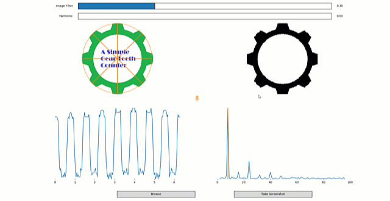

# simple-gear-tooth-counter
Simple Gear Tooth Counter

This is a simple tool for gear tooth (not only) counting
Please share your questions to Simon Ameye - AVL AST FRANCE

This requires Python 3

Following standard Python libraries are required :

numpy
open-cv
matplotlib
imageio
scipy
thinker
pyautogui
skimage

For Windows inatallation, please copy and paste the following text in your Windows command prompt (CMD)

pip install numpy
pip install open-cv
pip install matplotlib
pip install imageio
pip install scipy
pip install thinker
pip install pyautogui
pip install skimage
