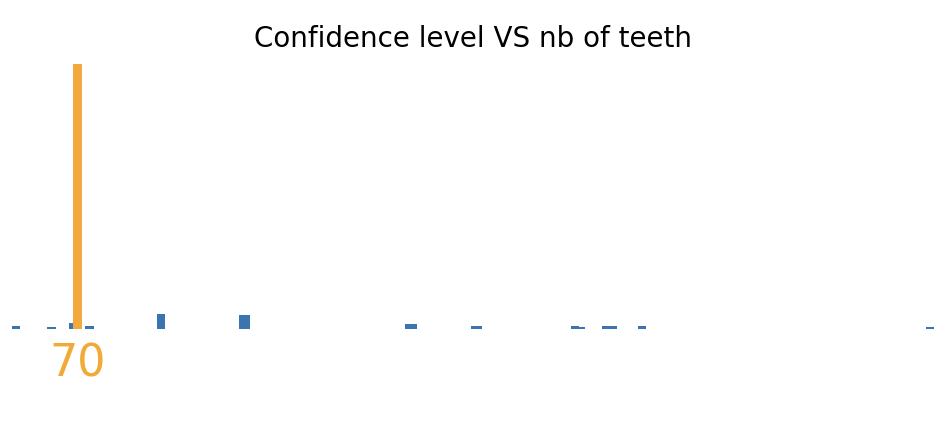
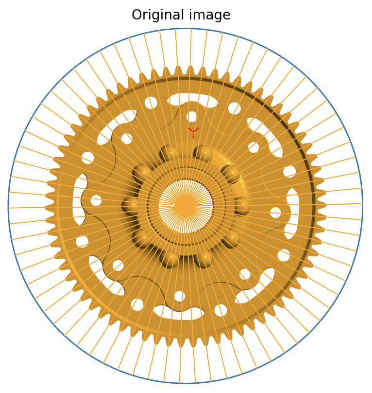
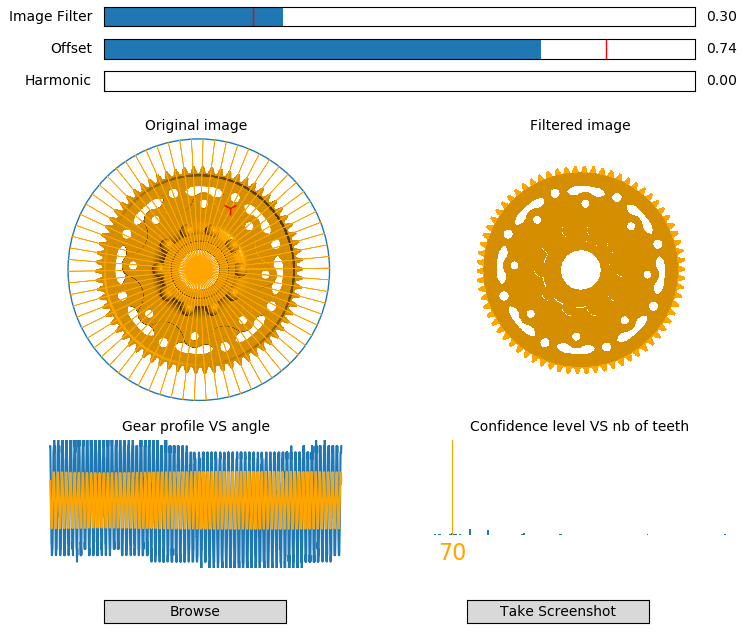
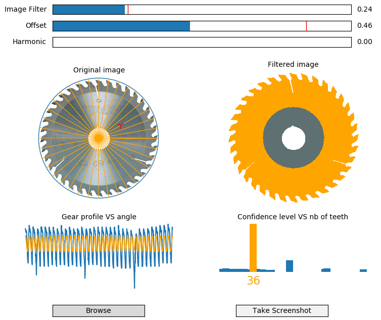
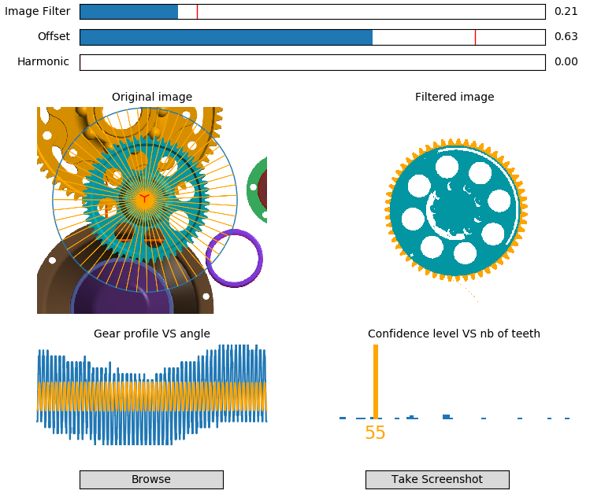
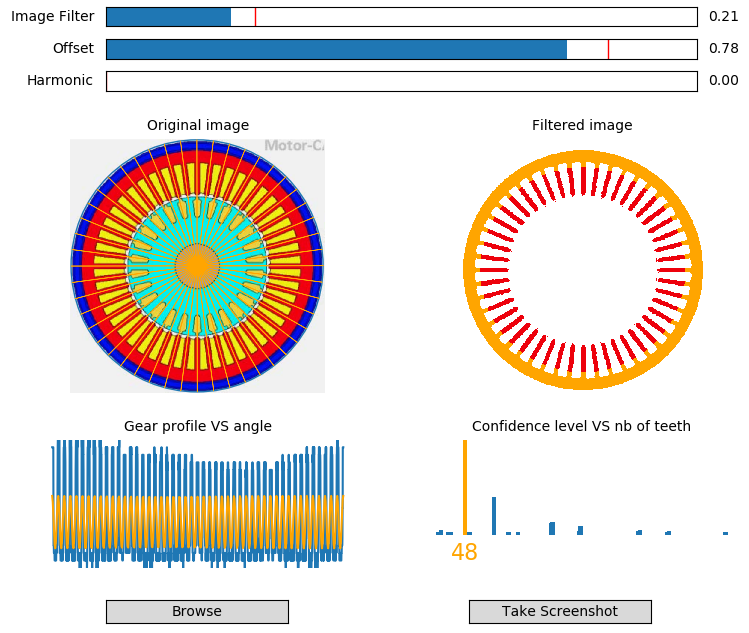
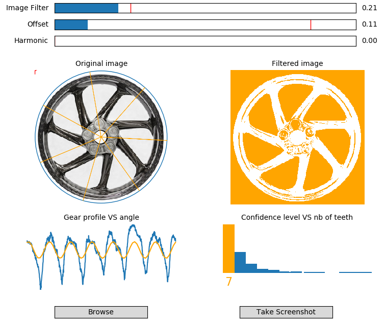

# Simple-gear-tooth-counter

This is a simple tool for gear tooth (not only) counting.
It helps people counting occurences on rotation-regular shapes on pictures.

This is a presonal project built to try an idea : doing FFT on pictures.

## Demo

https://user-images.githubusercontent.com/66630402/200177632-c102ef4d-3f17-4bc9-8578-0b121fb13601.mp4

## How it works

|  |  |
| --- | --- |
| 0) Raw image |  |
| 1) Shape is isolated using filters (Color selection, offset...), generating a new "black and white" picture. |  |
| 2) Image is "unrolled" using filtered image center of gravity as center (gears are always balanced) |  |
| 3) Gear profile is deduced by summing raws pixels |  |
| 4) Fast Fourrier Transform is applied to deduce harmonics. Amplitude of harmonics is used as "confidence level" |  |
| 5) Rays are plotted on raw image to allow user to vsualize and validate gear count |  |

## Usage
Run with Python3 ```python3 SimpleGearToothCounter.py```

## Examples
Here are some examples of objects that can be "counted"

<p float="left">
  
  
  
  
  
</p>

## Install
This requires Python 3

Following standard Python libraries are required :

numpy
open-cv
matplotlib
imageio
scipy
thinker
pyautogui
skimage


For Windows installation, please copy and paste the following text in your Windows command prompt (CMD)

```
pip install numpy
pip install open-cv
pip install matplotlib
pip install imageio
pip install scipy
pip install thinker
pip install pyautogui
pip install scikit-image
```
Linux :
```
sudo apt-get install python3
sudo apt install python3-pip
pip3 install scikit-image
pip3 install opencv-python
pip3 install skimage
pip3 install pyautogui
pip3 install scipy
pip3 install imageio
pip3 install matplotlib
pip3 install numpy
sudo apt-get install scrot
```
