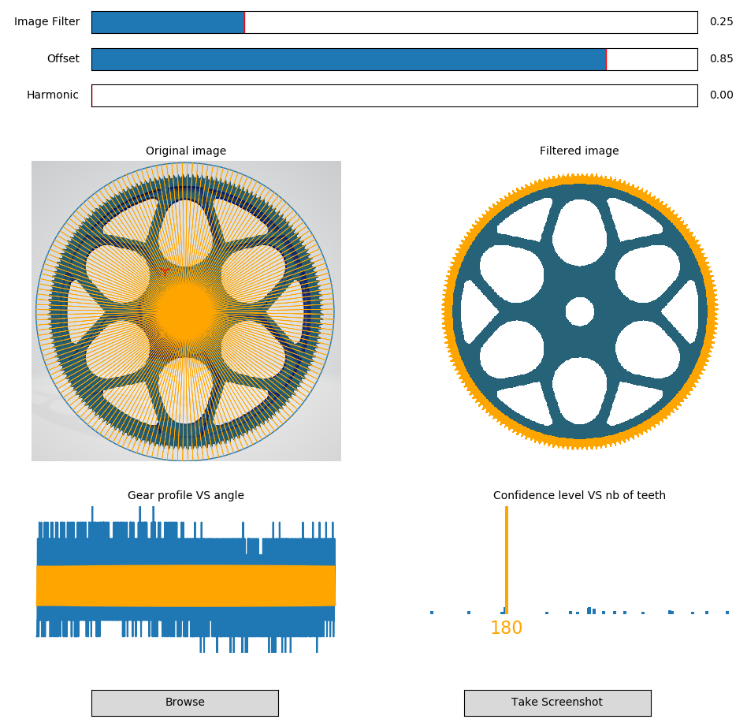

# simple-gear-tooth-counter

This is a simple tool for gear tooth (not only) counting.

Please ask your questions to Simon Ameye - AVL AST FRANCE



## Usage
Run with Python3 ```python3 SimpleGearToothCounter.py```

## Examples
Here are some examples of objects that can be "counted"
(2.png "title-1") (3.png "title-2")
(4.png "title-1") (5.png "title-2")
(6.png "title-1")

## Install
This requires Python 3

Following standard Python libraries are required :

numpy
open-cv
matplotlib
imageio
scipy
thinker
pyautogui
skimage


For Windows installation, please copy and paste the following text in your Windows command prompt (CMD)

- pip install numpy
- pip install open-cv
- pip install matplotlib
- pip install imageio
- pip install scipy
- pip install thinker
- pip install pyautogui
- pip install skimage

Linux : 
- sudo apt-get install python3
- sudo apt install python3-pip
- pip3 install scikit-image
- pip3 install opencv-python
- pip3 install skimage
- pip3 install pyautogui
- pip3 install scipy
- pip3 install imageio
- pip3 install matplotlib
- pip3 install numpy
- sudo apt-get install scrot
